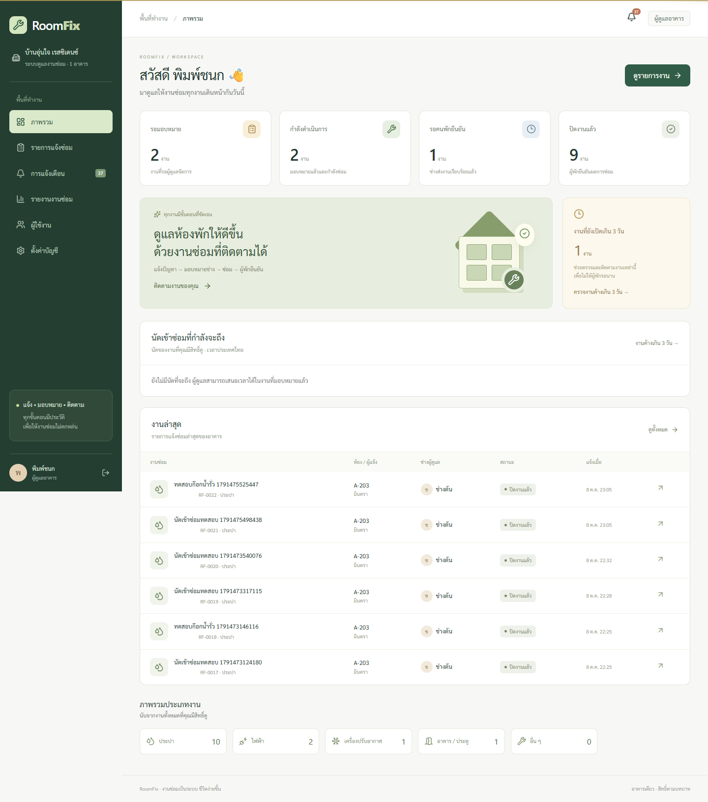
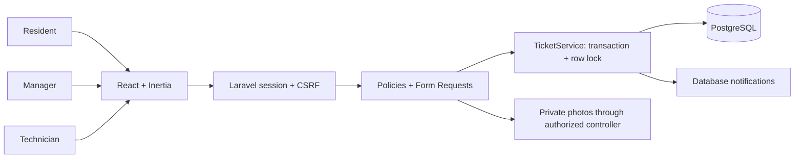
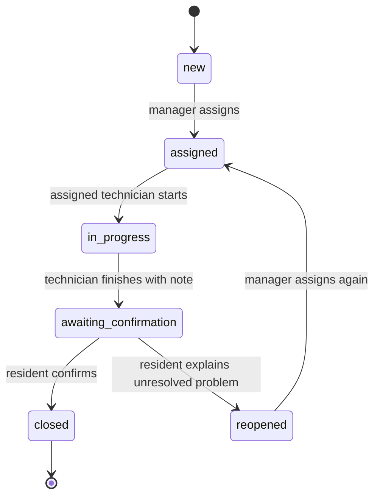
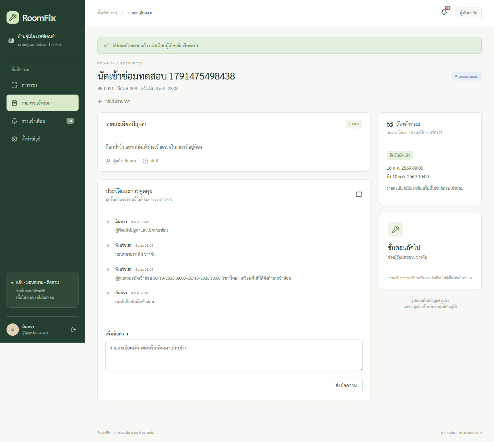
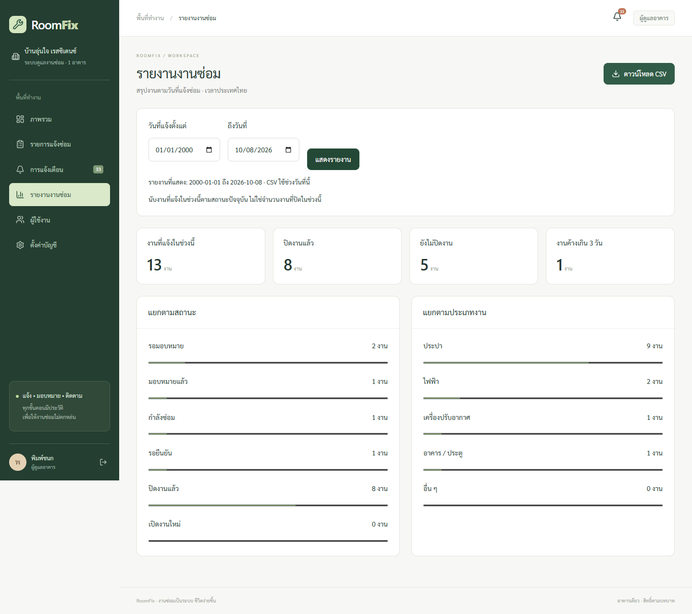

# RoomFix

ระบบแจ้งซ่อมสำหรับอาคารพักอาศัยหนึ่งอาคาร ตั้งแต่คนพักแจ้งปัญหา ผู้ดูแลมอบหมายช่าง ช่างส่งงาน จนคนพักตรวจและยืนยันผล งานทุกชิ้นมีผู้รับผิดชอบ รูปส่วนตัว และประวัติที่ติดตามได้

Built with **Laravel 13 · PHP 8.4 · React 19 · Inertia 3 · TypeScript · PostgreSQL 17**. A working full stack portfolio project with Thai UI, role policies, private uploads, automated workflow tests, and recoverable checkpoints.



## ใช้ทำอะไร

แทนการแจ้งซ่อมที่หล่นหายในกลุ่มแชท แต่ละงานมีเลขอ้างอิงและลำดับการรับผิดชอบที่ชัดเจน

| บทบาท | สิ่งที่ทำได้ |
| --- | --- |
| คนพัก | แจ้งปัญหาของห้องตัวเอง แนบรูป ติดตาม พูดคุย ยืนยันหรือเปิดงานใหม่ |
| ผู้ดูแล | ดูงานทั้งหมด กรองงาน มอบหมายช่าง สร้างบัญชีคนพักและช่าง |
| ช่าง | ดูงานที่ได้รับมอบหมาย เริ่มงาน ระบุผลการซ่อม ส่งให้คนพักตรวจ |

Dashboard นับตามสิทธิ์ของผู้ใช้ มีรายการล่าสุด ประเภทงาน และงานที่ยังเปิดเกิน 3 วัน รูปเก็บใน private storage และทุกคำขอตรวจสิทธิ์ฝั่งเซิร์ฟเวอร์ การแจ้งเตือนอยู่ในระบบและแสดงเมื่อโหลดหน้าถัดไป

## เริ่มในเครื่อง

ต้องมี Docker Desktop (Linux containers), Node.js 24+ และ Git ไม่ต้องเปลี่ยน PHP/XAMPP ที่ติดตั้งอยู่เดิม

```sh
cp .env.example .env
npm ci
docker compose build
docker compose run --rm --no-deps app composer install --no-interaction --prefer-dist
docker compose run --rm --no-deps app php artisan key:generate
docker compose up -d database
docker compose run --rm app php artisan migrate --force
docker compose run --rm app php artisan db:seed --class=DemoSeeder --force
npm run build
docker compose up -d app
```

Windows PowerShell ใช้ `Copy-Item .env.example .env` แทน `cp` ได้ เปิด **http://127.0.0.1:8003** แล้วเลือกบัญชีตัวอย่างบนหน้า login

| บัญชีตัวอย่าง | อีเมล | รหัสผ่าน |
| --- | --- | --- |
| ผู้ดูแล | manager@roomfix.test | RoomFixDemo!2026 |
| คนพัก A-203 | resident@roomfix.test | RoomFixDemo!2026 |
| คนพัก B-401 | resident2@roomfix.test | RoomFixDemo!2026 |
| ช่าง | tech@roomfix.test | RoomFixDemo!2026 |

ข้อมูลทั้งหมดเป็นข้อมูลสมมติ **DemoSeeder ปฏิเสธการรันนอก local/testing** และบัญชี demo ไม่สร้างอัตโนมัติ `DatabaseSeeder` เริ่มว่าง Docker เปิดเว็บเฉพาะ loopback และไม่เปิดพอร์ต PostgreSQL ไปภายนอก

PHP dependencies อยู่ใน named volume เพื่อหลีกเลี่ยงการอ่านไฟล์จำนวนมากบน Windows bind mount หากแก้ composer.json ให้รัน composer install ผ่าน compose อีกครั้ง Source code และรูปแนบอยู่ใน project directory; ข้อมูล PostgreSQL อยู่ใน Docker volume

## ทดลอง workflow

1. เข้าเป็นคนพัก กดแจ้งซ่อม ระบุปัญหาและแนบรูป
2. ออกจากระบบ เข้าเป็นผู้ดูแล เปิดงานใหม่ เลือกช่างและมอบหมาย
3. เข้าเป็นช่าง เริ่มดำเนินการ แล้วกรอกผลการซ่อมและส่งงาน
4. เข้าเป็นคนพัก ตรวจและยืนยัน หากยังมีปัญหา ระบุเหตุผลเพื่อเปิดงานใหม่

รูปสูงสุด 2 รูป รูปละ 3 MB (JPG/PNG/WebP, ไม่เกิน 3000×3000 px) ระดับเร่งด่วนใช้เพื่อจัดลำดับงาน ระบบไม่มีผู้เฝ้ารับเหตุฉุกเฉินตลอด 24 ชั่วโมง

## สถาปัตยกรรมและเหตุผล



Laravel + Inertia ทำให้ใช้ authentication/session/policies ชุดเดียวกับเว็บ React โดยไม่ต้องแยก API token และระบบ CORS PostgreSQL รองรับ foreign keys, indexes, transactions และล็อกงานระหว่างเปลี่ยนสถานะ React/TypeScript ช่วยจัด UI และฟอร์มตามบทบาท ค่า owner/room/status ถูกกำหนดโดยเซิร์ฟเวอร์ ไม่เชื่อจากฟอร์ม

`TicketService` ตรวจ state machine และตรวจสิทธิ์ซ้ำภายใต้ row lock ป้องกันช่างคนเดิมทำงานต่อหลังถูกเปลี่ยนผู้รับผิดชอบ การแก้ไขสถานะ ประวัติ และ notification อยู่ใน transaction เดียวกัน รูปที่อัปโหลดจะลบทิ้งหาก transaction ล้มเหลว



ไฟล์หลัก: `routes/web.php`, `app/Policies/TicketPolicy.php`, `app/Services/TicketService.php`, `app/Http/Requests`, `resources/js/pages`, `database/migrations`

## ตรวจสอบ

```sh
docker compose exec -T app php artisan test --compact
docker compose exec -T app vendor/bin/pint --test
npm run build
# ครั้งแรกในเครื่องที่ไม่มี Chrome: npx playwright install chromium
# ตั้ง PLAYWRIGHT_CHANNEL=chromium เพื่อใช้ browser ที่ Playwright ติดตั้ง
npm run test:e2e
```

Feature tests บังคับ SQLite in-memory **ก่อน Laravel boot** และหยุดทันทีถ้าฐานข้อมูลไม่ตรง ป้องกันค่า Docker/environment ทำให้ `RefreshDatabase` ล้างฐานข้อมูลแอป E2E ใช้เว็บจริงกับ PostgreSQL และสร้างข้อมูลสมมติของตัวเอง ไม่ reset ฐานข้อมูล ถ้าใช้ฐานข้อมูล demo เดิมหลายครั้งจะมีงานทดสอบเพิ่ม

Playwright ตรวจ workflow ครบสามบทบาท รูปข้ามห้องต้องถูกปฏิเสธ ประวัติและแจ้งเตือน การสร้างบัญชีโดยผู้ดูแล การค้นหา และหน้าจอมือถือ GitHub Actions ทำ build/Pint/PHPUnit และ E2E กับ PostgreSQL อัตโนมัติ

## Checkpoint / rollback

ดู [ขั้นตอนสำรองและกู้คืน](docs/recovery.md) มี ZIP ของโค้ดพร้อม SHA-256 และ snapshot ฐานข้อมูลพร้อมรูปแนบ การ restore สร้างโฟลเดอร์และฐานข้อมูลใหม่ ไม่ทับระบบที่ใช้อยู่ ไม่ใช้ git reset --hard หรือ migrate:fresh กับฐานข้อมูลใช้งาน

## นำไปใช้งานจริง

Compose ชุดนี้เป็น **local development runtime** ใช้ PHP development server การขึ้น production ต้องจัด PHP-FPM + web server + HTTPS และ persistent private storage เอง ดู [deployment checklist](docs/deployment.md)

รุ่นนี้รองรับหนึ่งอาคาร ผู้ดูแลสร้างบัญชีและแจ้งรหัสผ่านผ่านช่องทางส่วนตัว ยังไม่มี self-registration, email password reset, ค่าใช้จ่าย, realtime/email/LINE notification หรือระบบแยกหลายอาคาร รูปต้นฉบับไม่ได้ลบ EXIF ผู้ใช้ควรใช้ภาพที่ไม่มีข้อมูลอ่อนไหวเกินจำเป็น

## Portfolio description

> Built a Thai maintenance management system with Laravel, React/Inertia and PostgreSQL. Implemented role-based authorization, private photo access, transactional repair workflows with audit history, in-app notifications, automated integration/browser tests, and non-destructive code/database recovery.

License: MIT. Sarabun font licensed under SIL OFL; see public/fonts/OFL.txt.

## นัดหมายเข้าซ่อม (รุ่น 1.1)

ผู้ดูแลเสนอช่วงเวลาในงานที่มอบหมายแล้วและยังไม่เริ่มซ่อม คนพักยืนยันหรือแจ้งว่าไม่สะดวกพร้อมเหตุผล ช่างเห็นนัดและเริ่มงานได้เมื่อนัดได้รับการยืนยัน งานเดิมที่ยังไม่เคยนัดผ่านระบบยังเริ่มงานตาม workflow เดิมได้

- เวลาทั้งระบบแสดงเป็น Asia/Bangkok; ช่องวันเวลานัดใช้เวลาไทยเสมอ แม้เบราว์เซอร์อยู่เขตเวลาอื่น ข้อมูลนัดส่งพร้อม UTC offset และเก็บเป็น UTC
- ช่วงนัดไม่เกิน 4 ชั่วโมง และเริ่มในอนาคตภายใน 90 วัน นัดรอยืนยันจองเวลาช่างไว้ด้วย เพื่อกันผู้ดูแลวางนัดซ้อน
- ล็อกแถวช่างขณะตรวจ overlap และบันทึกนัด เพื่อให้คำขอจากคนละงานของช่างคนเดียวกันเรียงลำดับ ช่วงเวลาชนกันพอดีที่ขอบ เช่น 09–10 และ 10–11 ทำได้
- การเปลี่ยนนัด/มอบหมายใหม่เพิ่ม version; คำตอบจากหน้าเก่าจะถูกปฏิเสธ การเปลี่ยนผู้รับผิดชอบยกเลิกนัดเดิมและต้องตกลงใหม่
- ยกเลิกหรือปฏิเสธนัดจะคืนช่วงเวลาให้ช่าง ทุกการเสนอ/ยืนยัน/ปฏิเสธ/ยกเลิกมีประวัติและแจ้งเตือนในระบบ
- Dashboard แสดงนัดที่ใกล้ถึงตามสิทธิ์ และปุ่มงานค้างเกิน 3 วันเปิดรายการที่กรองงานค้างจริง (ไม่รวมงานปิดหรือรอคนพักยืนยันผล)

นัดหมายใช้วางแผนเวลา ไม่มีการส่ง LINE/email หรือแจ้งเตือนอัตโนมัติก่อนถึงนัด และไม่ได้บังคับว่าช่างต้องกดเริ่มตรงนาทีของนัด การเพิ่มตารางเป็น migration แบบเพิ่มคอลัมน์ ข้อมูลงานและรูปเดิมยังอยู่



## รายงานงานซ่อม (รุ่น 1.2)

ผู้ดูแลเปิดเมนู **รายงานงานซ่อม** เลือกวันที่แจ้งตั้งแต่/ถึงวันที่ แล้วดูจำนวนงาน สถานะปัจจุบัน ประเภท และงานค้างเกิน 3 วัน ส่งออก CSV ของช่วงวันที่ที่แสดงได้โดยตรง รองรับมือถือและกรณีไม่มีข้อมูล

- วันเริ่มและวันสิ้นสุดนับเต็มวันตาม Asia/Bangkok โดยแปลงขอบเขตเป็น UTC ก่อนค้นหา
- รายงานเป็นกลุ่มงานที่ **แจ้งในช่วงวันที่เลือก** ตามสถานะปัจจุบัน ไม่ใช่จำนวนงานที่ปิดในช่วงนั้น งานที่ปิดวันนี้แต่แจ้งนอกช่วงจะไม่รวม
- CSV มีรหัสงาน หัวข้อ ห้อง ประเภท/สถานะเป็นรหัสระบบ ชื่อช่าง และวันแจ้ง/วันปิดเป็นเวลาไทย ไม่มีอีเมล รหัสผ่าน รายละเอียดปัญหา หรือรูปแนบ
- CSV ใช้ UTF-8 BOM สำหรับข้อความไทย และเติม apostrophe หน้าเซลล์ที่อาจถูก spreadsheet ตีความเป็นสูตร
- หน้ารายงานและไฟล์ส่งออกจำกัดสิทธิ์เฉพาะผู้จัดการ การส่งออกจำกัด 10 ครั้งต่อนาที และไม่เก็บไฟล์รายงานไว้บนเซิร์ฟเวอร์


